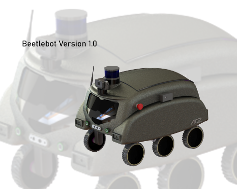
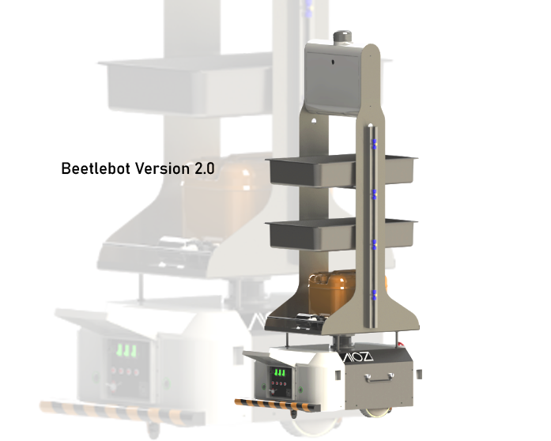
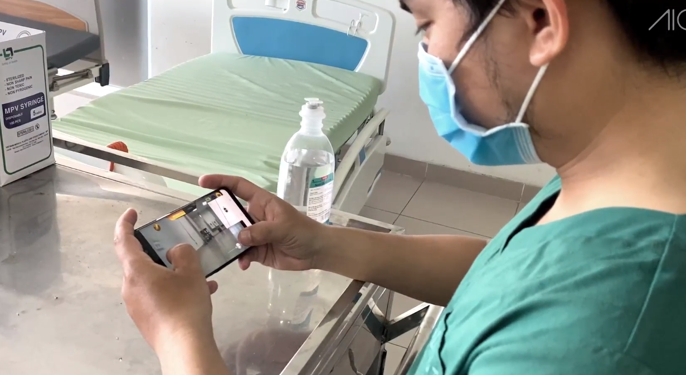
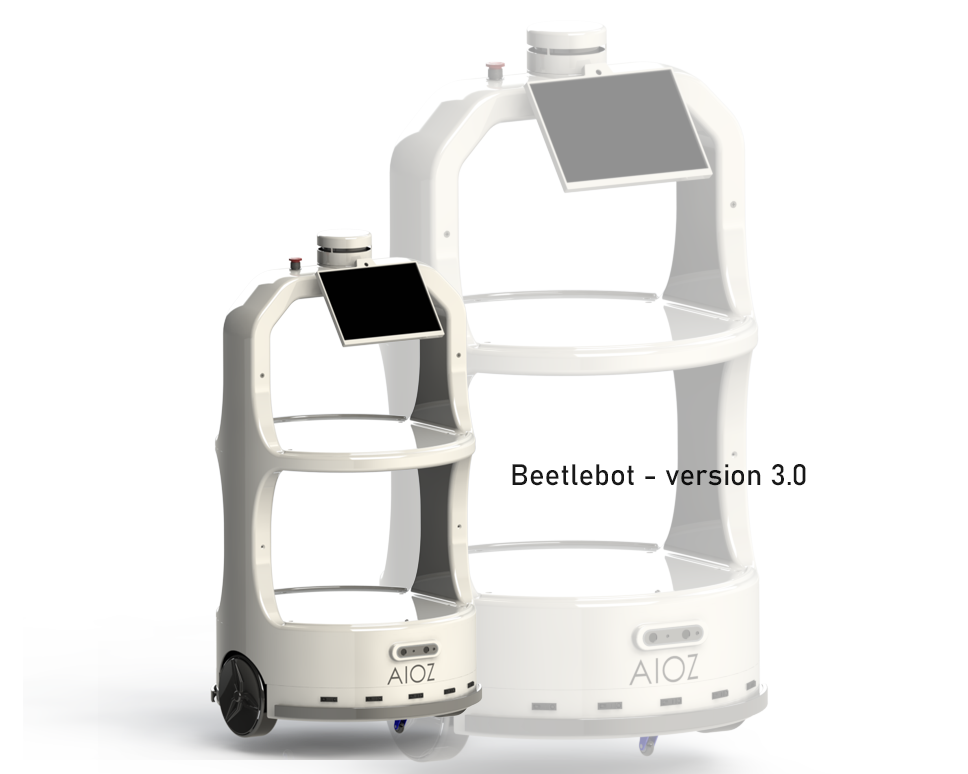

The Beetlebot project has gone through three major stages of development so far.

In the beginning, we were planning on designing a versatile robot that could cross forms with ease.
<!--truncate-->
Based on the Beetle spirit, we have designed the robot shape so that it resembles the Beetle, Both cute and close to the Beetle, while also reflecting the Beetle's image that we were inspired by.

The first Beetlebot had a six wheels structure to support the purpose of easily overcoming obstacles. This mechanism was extremely effective for the robot movement. However, we ran into a dilemma. The six-wheel structure is complex and requires a powerful engine in order to operate. This causes noises when the robot is running and also increases the robot's weight significantly due to the need of adding more batteries to the engine.

To overcome these shortcomings, we have decided to change the design and improve the engine of the robot.

We changed from six-wheeled to Differential drive engines. This simplifies the robot's construction yet still maintain the ability of moving flexibly around indoor environment. With the wheel structure being changed, the old shape is no longer suitable so we also redesigned the shape of the robot. We researched through many concepts and decided to choose a cylindrical design with the base that can be separated from the upper body. The base is considered as the robot's brain which contains sensors, motors, batteries, wheels engine. The body is a shelf that can be removed depending on the purpose of use. This design helps users to easily change and assemble the upper body, optimizing the robot's flexibility.

Although it’s no longer retaining the form of a Beetle, we still keep in our mind the "small but strong" spirit. We are happy with this new design.

In addition, to ensure safety while the robot is in operating, we have developed a mobile application which allows users to monitor the robot remotely. This application also gives users an option to directly control the robot. Sometime human help is needed even though the robot is autonomous. Remote operations enables us to deal with the tricky situations such as small or complicated areas.

Foreseeing the need for remote communication in socially segregated conditions, especially in hospitals, we also added a remote calling feature to the mobile application. Users can do video call to each other via a camera installed on top of the robot.

It can be said that phase two is currently the period containing the most modifications and improvements of the project.

In the second phase of the project, we also had a chance to test the robot in some hospitals and received some feedback. The shape of the robot has served well for the transportation of medicine or food, but overall the robot was still quite big, bulky, and made noises while operating.

Positive and sincere feedback from users has prompted us to continue improving the robot. The project has entered the third phase.

The third phase is the current phase of the project. At this stage, we continue to refine the shape of the robot to make it look compact and elegant while still maintaining the transportability.

In addition, we have improved the engine as well as the position and size of the wheels to create smoother movements.

**Road to the future**

With many designs of the body, we allow customers to customize the robot bases on their needs. Not only for delivery purpose, we also expand our robot use into further purposes. For example, we will integrate a robot hand for doing households, playing with children; a disinfectant spray or disinfectant light for sterilizing purposes.

Furthermore, we’ll implement multi-sensor system that can detect people’s body temperature, voice and other biometric features and use algorithms to determine whom to approach. All of these technologies are currently under-developed and will be ready to be integrated to the robot once the third stage of the project is finished.

The end of part 03.
