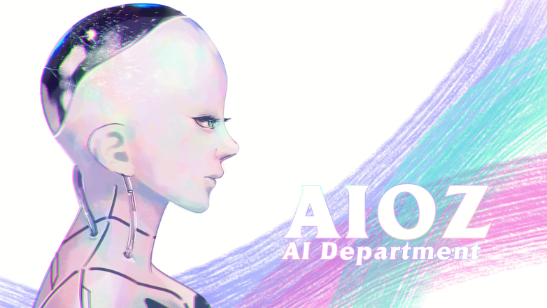

<!--truncate-->

I remembered the first time come to AIOZ is for an interview. The interviewer, now is my boss explained to me what AIOZ means. I was very impressed by what he said.

So what makes me one to be a part of AIOZ?

Established in 2018, AIOZ - a startup company based in Singapore, delivers to you the best AI solution for your in-house life by using advanced technologies to make it better and better. Procuring the whole thing in insourcing, we pride ourselves that we can offer our customers end-to-end products.

## What do we do?

Research and Development (R&D)

Our members are divided into three teams with different essential expertise and solid connections with an absolute passion for technology.

[Watch Here!](assets/2021-04-12-aioz-atoz/AIOZ_members_suptershort.mp4)

**Research team:** Based on the need of our near future, AIOZ's researchers will do depth study on a compulsory and necessary subject to discover solutions for our Product team to develop the product in theory to reality which is valuable and helpful to the community.

**AIAR team:** A combination of AI technology and Research. We are a team of experts in coding, deeply comprehending Artificial Intelligence and Robotics. Putting the research paper into life, our team formulates and develops algorithms and hardware to create AIOZ's products. For this stage, we pioneer to apply AI technology in building Robot which can change our future.

**AID team:** A team of talented, enthusiastic, innovative software engineers joins together. We focus on finding out AI solutions and build front-end web development to satisfy every different requirement of customers with the best effective technologies.

Besides, we are also willing to take coding challenges and competitions to improve our thinking, computing, hardware, and coding skills.

## Our Vision

With the ambition to be at the cutting edge of technology in Artificial Intelligence and Robotics, we can help you straightforwardly struggle with your life by using the power of technology.

## Our mission

Understand customers' need

Find solution

Make it come true

**AIOZ do everything from A to Z**
