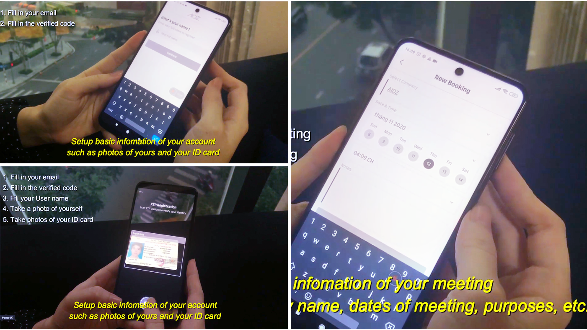
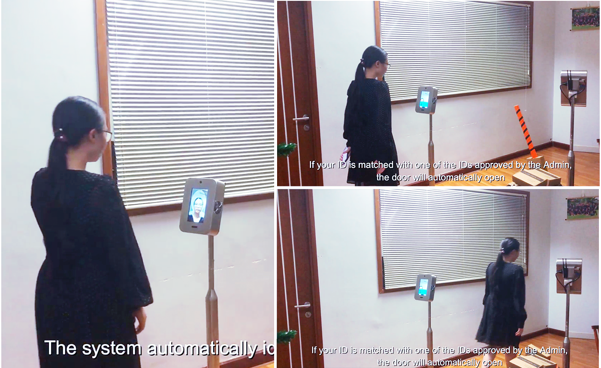
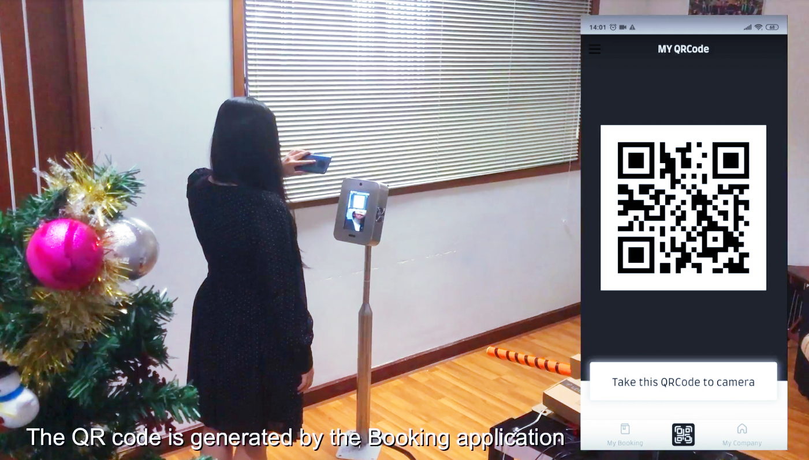

<!--truncate-->

The system helps you to control all access through a mobile application. This article will give you an overview of the usage as well as the features that our access control system provides.

Our mobile application allows visitors to request appointments remotely. First, you need to sign up for an account. Through a few steps of providing personal information, confirming ID, you can proceed to make an appointment.

First you need to sign up for an account. Through a few steps of setting up personal information and confirming your ID, you can proceed to make an appointment.

You can select a date, time, and add a note to your appointment, for example topics, purposes, or participants of the meetings. After confirming those information, your request will be sent to the admin. You just need to wait for the admin to confirm. As soon as the admin confirms, your appointment will be automatically booked to the system.

An automatic security base will be installed at the entrance. It resembles a security platform on highways but different in that this base is fully automatic with access control systems being integrated.

On the appointment date, you just need to verify your face at the security base, the system will automatically notify the admin to automatically confirm if you are the person who has an appointment. 

If the system takes too long to identify your face - this could be due to many factors like weather, clothes, or hairstyle - you verify yourself by scanning a QR code instead. To scan the code, you need to connect to the wifi of the area through the access control application.

Once you come in, the system records the entry time and date and when you leave, the system automatically removes your name from the booking list. All of this information will be updated to the mobile application for the admin to check at any time. 

All operations are completely automatic. It’s fast, simple and not relying on humans. Moreover, our system ensures that there is as less touchpoints as possible. Throughout the process, you aren't required to directly contact with any decide rather than your own smart phone. This system is simple, powerful and yet very safe for everyone. 

The end of part 02.
