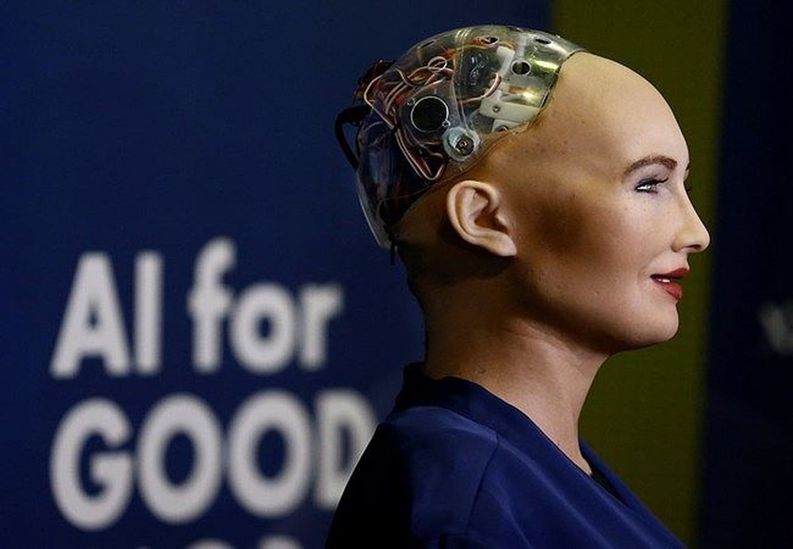
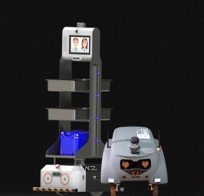
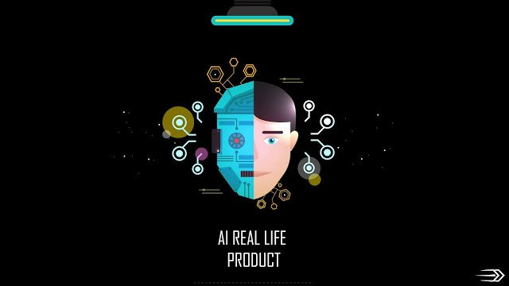

<!--truncate-->

In the industry 4.0 revolution with cutting-edge technology, many people don't know what AI is even it is more and more widespread.

So what do you think artificial intelligence is? Making a robot that can replace humans? So aren't we humans redundant? I used to feel like that foolishly.

When I first read the article about the robot named Ms. Sophia, I felt very admired for who created her, what a miracle product. At that time, I was completely unfamiliar with the definition of Artificial Intelligence and was lazy to learn. I always thought that AI was just applied to build robots. I also watch Hollywood science-fiction movies about Robots which take over the world, so I don't totally have sympathy for Robots.

But when I work at AIOZ, I known more about AI and realized that what I thought was completely wrong. Artificial intelligence is used to create many products, many systems that are helpful in many different fields. Our clients can be the people in the financial sector, they also can be the people in the transportation industry or in the medical sector.

### Very simple things have been optimized!

But when I work at AIOZ, I learned more about AI and realized that what I thought was completely wrong. Artificial intelligence is used to create many products, many systems that are helpful in many different fields. Our clients can be the people in the financial sector, and they also can be the people in the transportation or the medical industry.

AIOZ's beetle bot, which helps in quarantine

People are curious about AI because of what it may bring to our lives. Products that were shaped by artificial intelligence can optimize processes that people have to work for hours and weeks to complete, automatically detect and limit errors. Moreover, it also helps you to save labor costs, improve labor productivity.

### AI all around us!

Have you ever been used to have contact with AI technology? Maybe you have used a product of AI technology, but you are not aware that the product is embedded AI technology. With the development of science and technology, e-wallets are gradually gaining popularity. Have you ever verified your wallet with your ID card? If so, you have already used products of AI technology. By using the camera, the AI can quickly read and digitize the information on the ID card.

Or do you accidentally discover that the advertisements you see in the shopping malls are all about the things that you are interested in? This is also AI technology! Through the analysis of the characteristics, age, and gender to offer advertisements appropriate to your needs.

Artificial Intelligence is not here to replace us.  As industry insiders, who have deeply learned and comprehended the fantastic benefits of AI technology, we are very proud to create practical products that provide specific assistance for the community, and this is also the only goal that AIOZ is aiming for.
