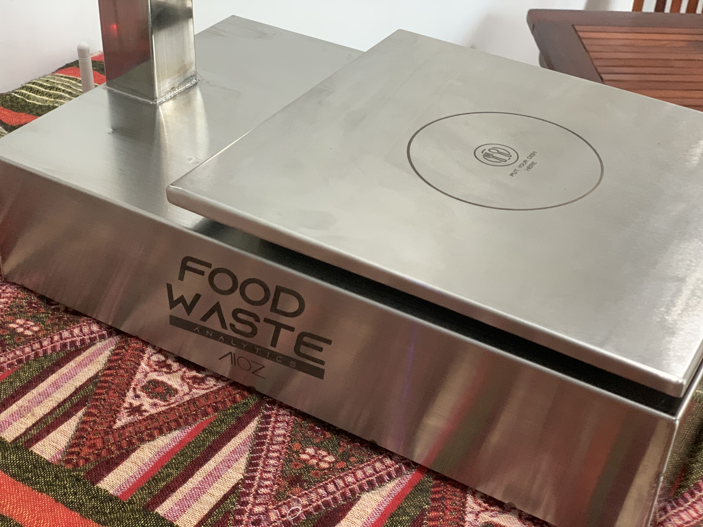
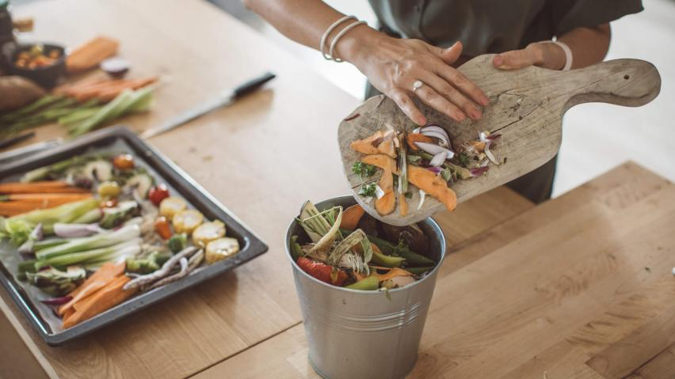
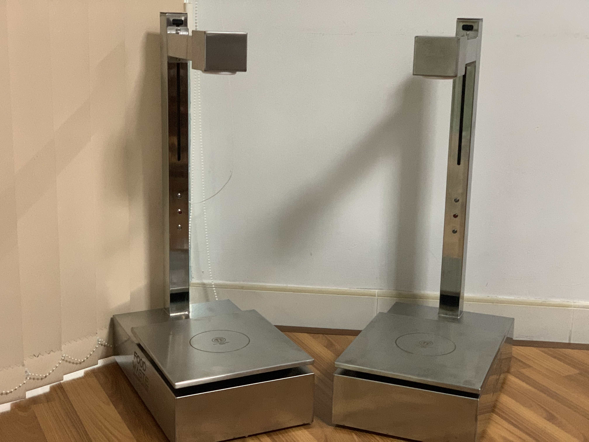

<!--truncate-->

### A product help you fight against food waste

Protecting the environment is an urgent mission that any organization, government, and individual are responsible for carrying out, but the amount of elimination waste in our everyday routine is still very much, seriously affecting our environment. Currently, we're taking many ways to reduce environmental pollution such as separating waste for recycling, reusing and reducing, using environmentally friendly products. But what about food consumed?

The situation of food waste in the world is alarming, which has staggering price tags, causing much damage to the economy. Recognizing this situation, many countries around the world began to fight against food waste. To do that, we first need to know the amount of leftover food each day, then sort them for recycling. But controlling the community's daily leftovers is a problem.

Comprehending this urgent need, AIOZ has embedded technology to shape a product that can measure the amount of food consumed, based on which, we can classify and then recycle. 

### Food waste in restaurants

Nowadays, as you can imagine, there is a great deal of food wasted is thrown out from restaurants or drink stores every single day. We do not know that wasting food will greatly affect our lives. Minimizing leftovers not only helps to protect the environment but also contributes to helping people in need of food around the world to have a little more food and drinks.

We can see the scene that occurs frequently in restaurants, the small piece of pork was left on the plate or some dishes on the table weren't finished. Even though the food is still usable, it's all going to be thrown out. Maybe the food at the restaurant does not please the customer. So how to know what customers like or dislike in order to adjust accordingly. We can count on the actual amount of food consumed left to know. But every day you have to serve hundreds of customers, how can you control it? If you gonna crazy about this, don't worry! the Food waste analysis of AIOZ can also help you.

By applying AI algorithms, we have created a product that can help you analyze and calculate the amount of food waste that customers left. Based on that, you will have the basis to adjust your menu to more suitable to the needs of customers.

Moreover, our products can also help you measure whether the dishes are made to meet the standards, help you control the quality of your products, giving your customers the most satisfaction.

With practical features, we believe that the AIOZ food waste analytic is the best solution for countries in the fight against food waste. With the desire to join hands and accompany to minimize the amount of food waste every day, I hope that AIOZ food waste analytic can contribute a small part to protect our green planet.
