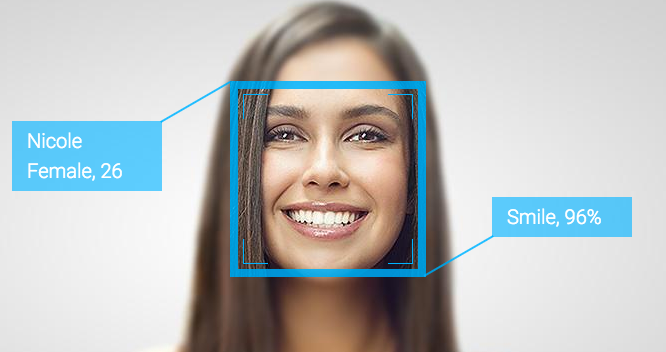

<!--truncate-->

Emotion recognition is the process of **identifying emotions** such as disgust, joy, anger, surprise, fear, or sadness on a human face with image processing software.

Emotion recognition is no longer a new topic. With the advancement of modern technology, the application of emotional recognition has gone far beyond what you probably know. This technology has been applied to a myriad of different areas such as business, teaching, healthcare, surveillance, entertainment, advertising, impersonation detection, and even malicious purposes such as disguise. In this post, we will explore the applications that revolve around this technology.

One of the most common uses of emotional recognition is to track and evaluate a person's reactions, thereby predicting their thoughts.

For example, instead of filling out a lengthy survey after watching an advertisement, we can consent to have a camera record the customers’ faces and note during which parts of the experience the audiences show expressions such as boredom, interest, confusion, or smiling, therefore deciding to offer them to buy a product or not. The same idea can be applied to movies when the audience's reaction is recorded to judge the quality of a movie. Are they watching movies concentratedly or not? Are they excited or reacting strongly to action scenes? Are they touched by the emotional scenes? All of these will be valuable data helping cinemas to survey customers’ tastes and increase sales.

This idea can also be applied to schools where we measure real-time learners' responses to educational content; and, at the same time, measure the effectiveness of lecturers.

We can consent to have a camera record the customers’ faces and note during which parts of the experience the audiences show expressions such as boredom, interest, confusion, or smiling,

Using facial emotion recognition and face tracking software, one can create virtual avatars. In essence, this technology has been applied to Virtual Youtuber or Vtuber. These are YouTube content creators but don’t use their images. They use a specially designed cartoon character as an avatar. VTubers use technology to instill emotions on their faces into their avatars. This character replaces a real person taking on many roles such as product promotion, entertainment, education, etc.

Furthermore, emotion recognition is also implemented on robots, specifically robots that communicate with humans. When emotion recognition technology is integrated into the robot, they are capable of reacting to the user's emotions and responding to those. This is an essential step in making robots closer and more friendly to humans, not to mention that researching and designing robots close to humans is a future trend.

VTubers use technology to instill emotions on their faces into their avatars.

Among other verticals that can benefit from this technology are automotive, healthcare and gaming, adding it can play an important part in security, too. It can identify people in a crowd, monitor citizens for suspicious behavior by tracking their current emotional state. It can be used to stop criminals and potential terrorists preemptively.

### Conclusion

Humans are often more emotional than we wish to be, and emotions affect how we act more than we thought. Emotion data provides crucial insights that allow researchers to gain insight into complex human behaviors in greater depth. Emotions can play a role in all kinds of matters. Let’s discover how emotion recognition can improve your marketing in the next part.
