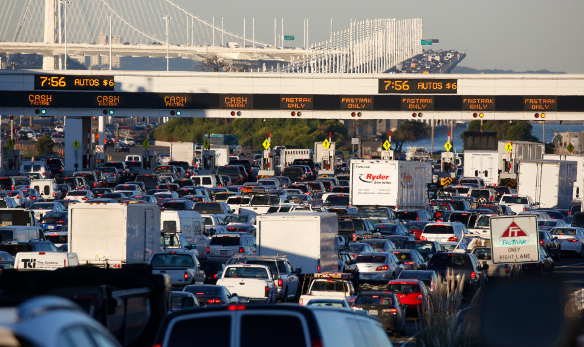

<!--truncate-->

We're living in the era of technological development, so everything is automated is no longer strange to everyone. Traffic jams at toll booths are a familiar image for traffic participants. Especially during the holidays, it can take you hours to get out of it. Therefore, introducing the Electronic Toll Collection System (ETC) is an effective solution to solve this situation.

### What is ETC?

By embedding modern technical technology, a non-stop automatic toll collection station, also known as Electronic Toll Collection (ETC), is a system that automatically collects tolls from the vehicle's user when passing through toll stations on highways without having to stop the car to buy a ticket like before.

### Why should we use ETC?

There is no doubt that ETC saves us a lot of time. Instead of taking 2-3 minutes to stop and buy a toll ticket, it takes less than 1 minute without having to stop when using ETC.

Moreover, using ETC, there will be no need for paper tickets anymore; this helps us save many ticket printing costs and contributes to environmental protection. Besides, not using paper tickets also means that there is no need for workers to be on duty 24/24 at toll booths anymore to cut down operating costs.

Each of us once had to sit and stare at the endless time in the car at the toll booths because of the increased traffic during the holidays. So ETC has shown us a very clear benefit that it helps us to reduce congestion during rush hour and holidays.

In addition, when the Covid-19 epidemic is still severe worldwide, automatic toll collection will limit human-to-human contact, minimize the risk of infection, and apply technological utilities to join hands to fight against the Covid-19 epidemic.

As a company that provides practical techniques for businesses, through the use of AI and Computer Vision solutions, AIOZ has built and completed the AIOZ - ETC system. This system can analyze images from surveillance cameras located at the vehicle tollbooth.

### How ETC of AIOZ work?

When the vehicle passes the station, the surveillance cameras will capture the vehicle's license plate and send it to the system. Through data from the camera, the system will verify the type of vehicle and count the axle. Based on that, our system will classify vehicles determine the tolls to be collected. When the transaction is successful, the barrier at the station will also automatically open for the vehicle to pass. The system will record the date, month, time, license plate, and axle number; this information will be automatically stored on the system.

At the same time, the system will also automatically deduct money from the accounts of road users. However, there are some cases that the customer's account has no money, so the system can not collect the fee, and they will return to buying tickets with cash. To overcome this situation, AIOZ - ETC has integrated a debit feature and must be paid within 15 days. AIOZ is still constantly trying to improve more features to meet each customer's different needs.

It can be seen that technology has assisted us a lot in life's problems. The difficulties around us are thorny questions that technology engineers have to find solutions. With AIOZ, it is about taking more and more advantage to our lives.
