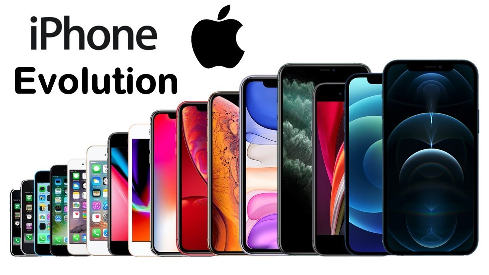
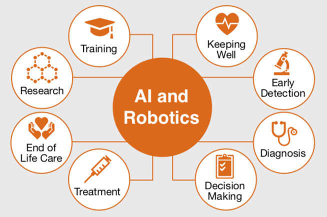

<!--truncate-->
I cannot remember when technology steps into our life getting more innovative and advanced. We have to admit that technology has improved our life from a minor thing; shortly, I believe it will become a universal communication tool, a powerful utility, a kindly friend to humans. In one way or another, technology has changed our life a lot. Let's see a few advantages that technology has brought to us.

### Make life faster!

Many people say that technology, especially a smartphone, creates a big gap between us; reduces face-to-face contact. But can you imagine one day without a smartphone?  

The smartphone is no longer a strange thing for everyone, and it can even be said that it is our inseparable object. Not only smartphones, but most people also have tablets, laptops, or smartwatches nowadays. We can contact other people from anywhere, anytime. Flashback 20 years ago, it took you few days or even a month to send a letter to a recipient, not to mention it can get lost. But now, thank technology, just in few second with a touch, the receiver, no matter where he or she is, they can receive it once you have sent. On the other hand, with this small device, we can do many things, make our life more and more efficient, such as taking photos, listening to music, watching videos, playing games, etc. Many functionalities were integrated into one device.

It has been 14 years after the first iPhone's introduction, the beginning of the smartphone era. Now, there are more than 5 billion people use smartphones, equivalent to 66% of the total world population.

Let's see how iPhone has changed in the past 14 years.

Technology is getting better and better. Now, smartphones are not only armed with expedient features but also equipped with advanced technologies like Artificial Intelligence. As you may know, the integration of virtual assistant - Siri into the iPhone in 2011 was a breakthrough for Apple to bring users new experiences and valuable utilities. To give an illustration, Siri - an Intelligent assistant, saved people from death. I have read an article in a mother of a one-year-old girl, shouted: "Hey SIRI, call an ambulance" when she saw her daughter’s face turning blue. Instead of running to get the phone and dial an ambulance, it may delay the first aid for her baby. Within no time, SIRI dialed the nearest hospital. The ambulance had arrived immediately and survived her baby with medication. After this accident, she wrote a thanking letter to Apple for saving her daughter's life.

Smartphones and technology are also applied to create products that help you save time and get things done more quickly, such as electronic devices, cars, planes, etc. Moreover, today's technology is going further and further as applications are built to meet the different demands of society. The 4.0 technology era can be seen as the explosion of AI technology that helps modern people optimize time, cost, and human resources in many socio-economic fields such as health care, education, finance, economics, transportation, etc. Something we expected AI and robotics could do in the past is not futuristic anymore.

For example, customers always need to have their problems solved promptly, but sometimes they will have to wait because the tellers are busy if they use a teller to do customer service. Many banks have now switched to Chatbots to overcome this problem, replacing bank officers to answer customer questions quickly and 24/7. The chatbot is a typical example of the application of AI technology in finance and banking.

As a technology company, we have also developed AI and Robotics applications to optimize your time, such as OneKYC - an application to identify customers via ID card, takes less than 3 seconds to verify and store customer information; Access Control System- smart booking door application; ETC- automatic collect your toll fee, etc. We, AIOZ, are continuously researching and developing more products to do many activities without spending much time.

What's more? Please stay tuned for part 2.
