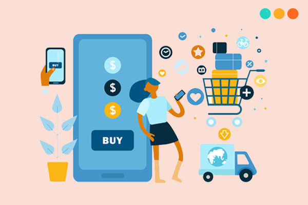
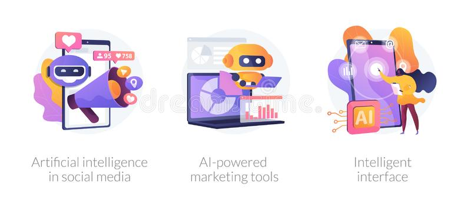

Source: [https://pegus.digital/](https://pegus.digital/)

I believe that people who are used to the presence of technology in daily life, have experienced in using technology. Although there are still some limitations, we cannot deny the wonderful conveniences that technology has brought to us.

### Make life more convenient!

Technology is built to make our life more convenient whether it in finance, economics, business, education, or what else.

Look back in the past, it takes time to go to the bank to withdraw money, open an account, get a loan, in some situations, you have to wait for long. But now with just a few steps by using internet banking you can complete a transaction in less than two minutes. Now, customers can do all this anywhere, anytime. Currently, banking applications are increasingly convenient and customer-friendly, with high security. Therefore, due to the convenience of technology, there has been an increase in using E-banking.

In the current global context when the Covid-19 pandemic has hit all the corners of the world, this is when e-commerce platforms become more useful than ever. Purchase things have never straightforward like this, you don't have to go to one store or another to choose the items you like. Nowadays, with just a smartphone, you can view hundreds of stores without much effort. Moreover, shopping online helps us to save a considerable amount of money. Because the seller does not have to pay much for renting space, the price of products on e-commerce platforms will be cheaper than when you come to buy directly at the store.

Source: [https://stepup.edu.vn/](https://stepup.edu.vn/)

On the other hand, when buying goods on e-commerce sites you can use online payment methods, paying without cash can reduce many risks such as theft or loss. In the past, you had to carry a bunch of money and go to the store to buy, now with online payment, you can buy anywhere you want.

Not only that, finding information has become very easy thanks to the Internet, books are no longer the only source for us to learn. Although there is also misinformation, if you know how to filter, the knowledge on the Internet is an endless store of knowledge. Moreover, many people have switched to reading online instead of reading books as before. The speed of spreading information on the Internet is also much faster through social networking sites such as Facebook, Instagram, Twitter, etc.

How we can forget the role of technology in business? 

Technology makes it easier to target customers. In today's busy working environment, an indispensable tool is a computer. You use your computer to connect with customers, connect with colleagues. There are more companies that handle customer service by using technology such as e-mail, phone or chatbot, etc. in order to optimize their operations, saving operating costs and labor costs. 

In addition, technology also gives you great marketing tools. It can be said that a website is the most basic step for you to attract impressions from customers, many businesses today pay much attention to building websites, bringing the company's name closer to customers. You can also run Marketing strategies on social networking platforms, with a huge number of users today, running ads on Facebook, Instagram, or Twitter pages, etc. is very effective.

Source: [https://www.dreamstime.com/](https://www.dreamstime.com/)

Besides, advanced technology also provides us with smart marketing applications that automatically identify customers, from which you can build a system of potential customers and offer appropriate marketing strategies. You can see that Facebook is now able to run ads to the right customers through technology solutions that track user habits. Applying algorithms of artificial intelligence is also available through gender, age, and offers ads that are suitable for that customer. There are a lot of ways by using AI to improve your marketing performance. 

These things above can prove that technology products around us help us answer whether technology makes our lives more convenient.  AIOZ is proud of ourselves that we have built some products which useful for humans lives like AIOZ Smart Advertising - a fantastic application for your company to do marketing strategies; AIOZ food waste analysis - help you solve food waste problem; Beetle Bot -  help you do the specific indoor tasks. 

Anything else? Part 3 is right behind you.
