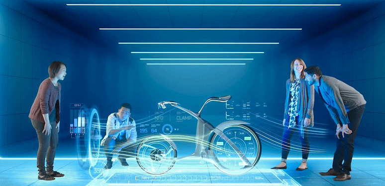
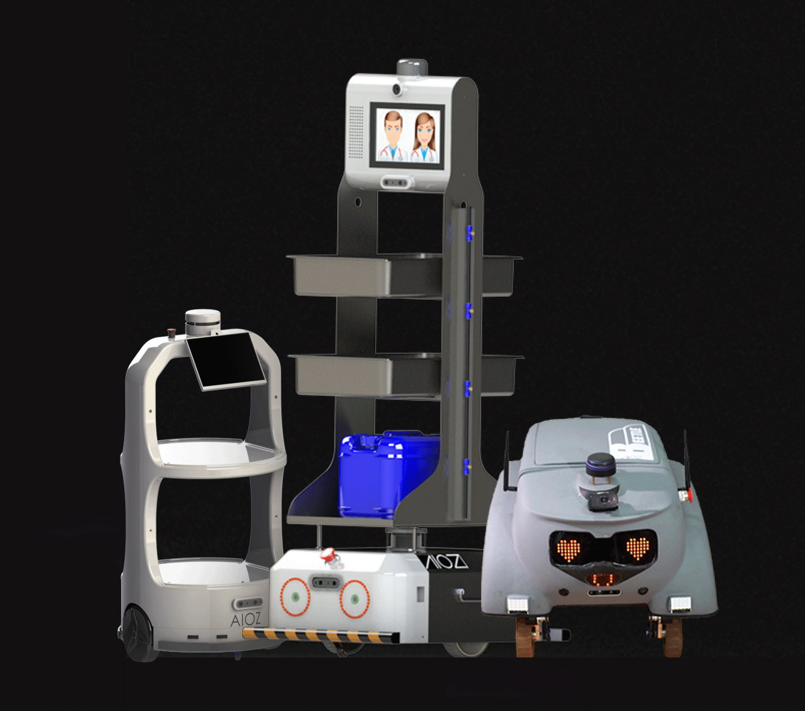
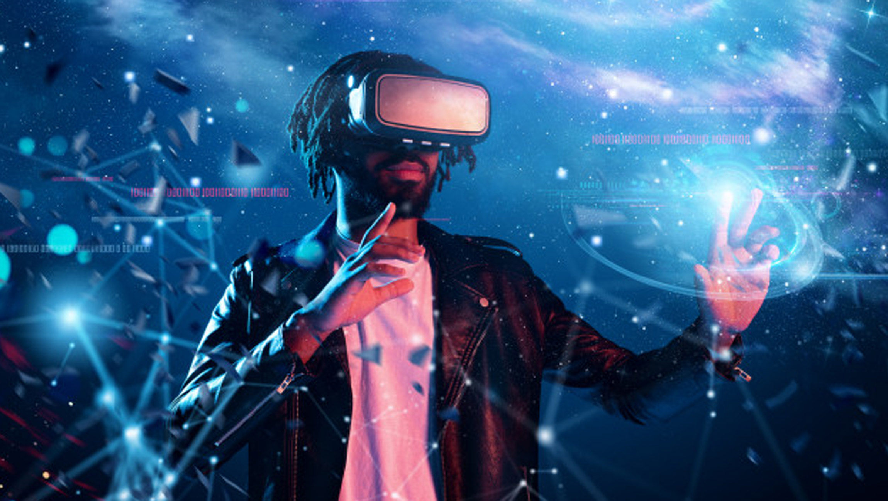
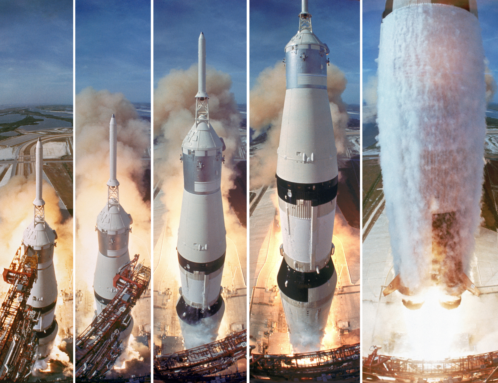

<!--truncate-->

Source: [https://www.ncta.com](https://www.ncta.com/)/

When discuss about technology what you do think of?

Things that we thought only existed in sci-fi movies, today, thanks to the development of technology, have gradually become a reality. In the 4.0 technology era, the research and the creation of new technologies is one of the global priorities.

The advanced technologies which were shown in the film such as modern spaceships, remote-controlled drones, life-saving robots, smart home systems, etc. We used to think that it was unrealistic. Although the current level of science and technology still needs to be further improved, it can still realize some "fiction" ideas in the film.

Remember when robots were only in movies, now you can see all kinds of robots were built to make your life simpler. In the past, it took a lot of effort to clean the house, and so the vacuum cleaner was born, but it still takes your time. The advent of house cleaning robots has been able to solve this problem. With just a few simple steps, the robot is like a real maid to help you vacuum and clean the house. You can use that time to do other things.

Besides, there are delivery robots, medical examination and treatment robots, furniture transport robots in warehouses, etc. Engineers also create robots that look like humans to communicate with humans by applying artificial intelligence to them, such as Sophia, Erica, etc. Moreover, they also have great potential in many industries, artificial intelligence will gradually become popular in people's lives.

AIOZ's Beetle bot- Help to delivery; help in quarantine area

You watch the intense battles between robots and robots in Hollywood movies and also want to immerse yourself in those dramatic fights, now with highly entertaining robot fighting matches that can satisfy you, There, technologists will bring their self-made robots to the competition, a match that can bring you a full-fledged fighting scene.

Or you can immerse yourself in cinematic footage, no longer boring black and white 2D images like before, cinema in the 4.0 technology era can bring you the most authentic experiences. Technology applications such as AI in design, image and sound processing; Virtual Reality - VR; CGI technology, etc. used by filmmakers to bring audiences exciting blockbusters.

Source: [https://martechseries.com](https://martechseries.com/)/

A few years ago, I watched a movie episode of the famous series: detective Conan with the content revolving around the crime scene in the virtual reality space of a video game, the player just sat in a cocoon and sleep, but what happens in that game they can truly feel every centimeter. At that time I thought, how can it be so real and I had to change my mind. With the development of technology today, that is completely possible.

In the past, theories about sending people into space were considered funny stories for entertainment, but more than 50 years ago that was not far away when Neil Armstrong set his first steps on the Moon, opening a new era for the world's spacecraft industry. It is the story of more than 50 years ago that we can see how technology has grown tremendously.

Even more prominent, when sending humans to Mars is still quite challenging, but now there are pioneering technologies in this field with the desire to successfully conquer the Red planet, such as the US, China, Russia, the UAE have initially approached Mars as the US successfully launched the Perseverance space probe and followed by China's Tianwen-1 spacecraft. It can also be said that this is a technology race between countries.

"No dream is too high" - Buzz Aldrin (Apollo 11 Astronaut)

Source: [https://www.life.com](https://www.life.com/)/

Although with the current development of science and technology, many people fear that machines and robots will replace humans in many aspects, the risk of job loss will increase. Everything has its good and bad sides, but the technology was created to make people's lives simpler, not to rule the world.

The transformation of technology with the 4.0 revolution is characterized by the following elements: Artificial Intelligence (AI), Internet of Things (IoT), and big data system (Big Data) made many of the previous theories reality. Join AIOZ towards a future where technology gives you great experiences.

The end of this series!
