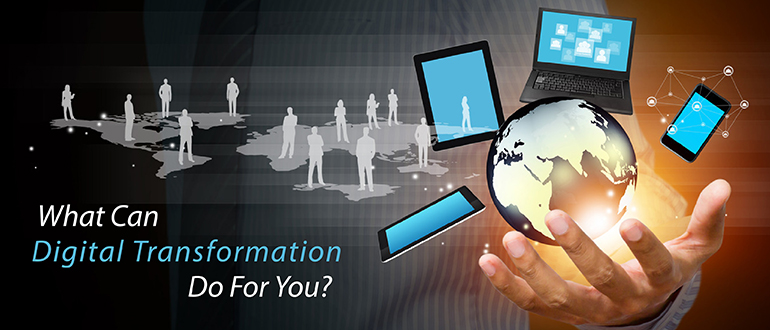

Source: [https://devops.com/](https://devops.com/)

Recently, digital technology has made radical changes. Gen Z is currently the generation that uses the most digital technology applications. This is also the generation that plays a very important role in the development of digital products to realize the goal of digitizing the real world.

### Who is Gen Z?

Gen Z is the workforce that is mostly young people born between 1996 and 2012, exposed to technology at a very early age, quite familiar with technology, and straightforwardly catches up with new technology trends. There are about 2.6 billion Gen Z people in the world today, accounting for one-third of the world's population. They were born in the boom of digital technology, so they tend to like online activities on the Internet, popular social networks like Facebook, Instagram, Twitter, etc. was no longer a stranger to them.

### Gen Z's online behavior

Talking about the digital world, we have to mention Gen Z, they are the generation of the digital age, the generation born and grown up with the Internet. So the fact that society is gradually digitizing has little effect on their lifestyle. Gen Z can access and find information quickly. 

Currently, online courses are quite popular on the Internet. During the outbreak of the Covid-19 epidemic, the online learning method was also thoroughly applied. In response to the Covid-19 pandemic, digital technology plays a very important role. You can see that the use of online means can help reduce not only person-to-person contact but also the possibility of community transmission.

Source: [https://afamily.vn/](https://afamily.vn/)

While previous generations are struggling to get used to technology applications such as Grab, Uber, Lazada, etc. Some people will find it difficult to use and decide to return to traditional ways. However, Gen Z is not only proficient in using it, but also requires more utilities and more novelty.

More than 90% of young people today prefer to use digital technology applications such as taxi applications, food orders online, or online shopping because of its convenience. They still can enjoy fantastic cuisines and buy the products that satisfy them without wasting time or taking much effort.

In 2017, I heard a speech by Jack Ma, the powerful chairman of Alibaba Group when he came to Vietnam. I was very impressed with what he said: " About online payment, I found that they have a mobile phone and they also have a lot of cash. We should kill all the cash. We should use mobile phone payment". China is currently one of the leading countries in building a cashless society, electronic payments are gradually becoming the exclusive payment method in China, many places in China are not even accepting payment in cash.

Source: [https://bantrekhoinghiep.wordpress.com/](https://bantrekhoinghiep.wordpress.com/)

As a Gen Z who has experienced in using e-wallets, I can see the handiness that it brings, both saving transaction time and having attractive incentives. While cash transactions can bring many inconveniences, the security is either not high. Using an e-wallet also helps you manage your money, avoiding unfortunate losses.

The buying habits of young people are changing step by step, they find it convenient to buy online, so online business is currently a popular craze on the Internet. With current e-commerce applications, not only can you buy goods domestically but you can also buy goods internationally. This helps to expand the market for those of you who are intending to run a business.

Since most of Gen Z's young generation is now tendency shopping online, the use of traditional marketing methods such as posters or flyers is no longer appropriate. With Gen Z customers, you must build appropriate marketing strategies on social networking sites to attract their attention. So the expansion of digital marketing nowadays is obvious. 

### Which challenge Gen Z has to face in the digital world?

The greatest challenge is to have the knowledge to keep up with the changes of technology and to be wise to use the Internet reasonably, not to abuse them. Humans created technology so we are always smarter than them. However, if we do not know how to learn and cultivate more experience, we will become behind the times.

A group of Gen Z AIOZers who built many technology applications and products in digital world

AIOZers are not only the young generation of Gen Z but also people in the technology industry so we are confident in our ability to grasp technology trends to apply them to products. With a new way of thinking, we believe that it is possible to create breakthrough technology products.

Let's be waiting for it! We - AIOZ is ready for the digital world!

The end of part 1.
