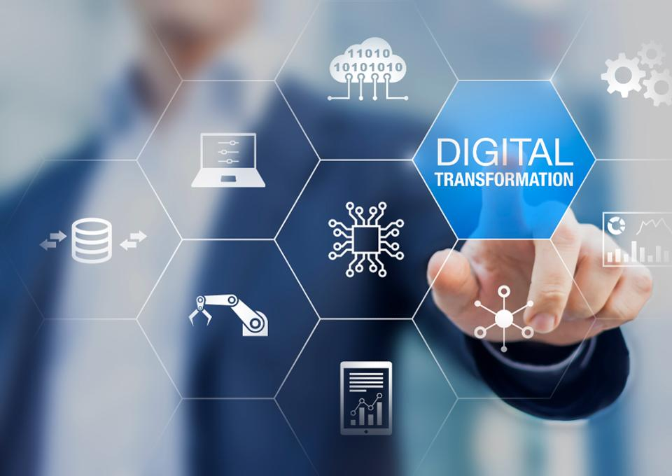
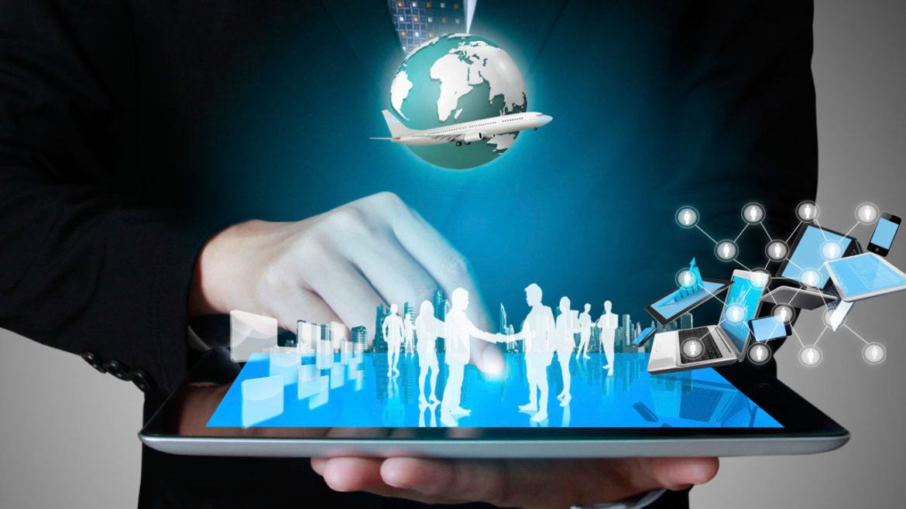
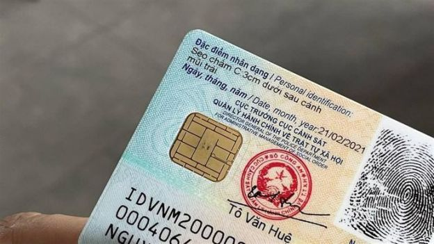

[https://timviec365.vn/](https://timviec365.vn/)

When it comes to the digital world, the first thing that appears to mind is digitization. Perhaps we never thought that science and technology could develop as today. Now is the era of data, everything is gradually being digitized, this is the inevitable process of the 4.0 technology revolution.

### What is digitization?

 According to Wikipedia: "Digitization is the process of converting information into a digital format." 

It is hard to deny the great benefit of digitization, it helps us to save time, space, and costs. Digitalization is impacting every sector. Compared to Gen Z, previous generations are facing many difficulties when everything is gradually digitized like this. Businesses also have to change the way they operate to keep up with the times.

Do you adapt to this change?

### For companies

Companies are transforming to store files in digital format because:

- Easy to search and not taking much space to storage
- Avoid the cases of damage, loss.
- Manage and retrieve data easily.
- Flexibility in revising and correcting documents
- Optimize management and storage costs

Companies are now increasingly applying technology and consider technology an indispensable part of operating production and business activities. Regardless of the industry, by digitizing data and then do digital transformation, companies have been able to simplify their operations.

Source: [https://ladyboss.asia/](https://ladyboss.asia/)

The 4.0 era is the intersection of advanced technologies such as Big data, IoT, and AI. AI is developing more and more, so many companies would like to apply them to reduce operating and labor costs and improve business efficiency. Statistics show that companies that apply technology in their business have a higher growth rate than companies that use traditional methods.

Besides, many companies also apply AI, computer vision, etc. in marketing activities to attract customers, AI solutions can analyze customer behavior and offer a suitable marketing strategy for the customer group. Digitization and digital transformation have greatly helped businesses in the race to the market.

### For technology users

How about those who are not familiar with technology?

Today's technology products are all built to be simple for users to use. However, there are still many people who still face many barriers when using them. Especially people over 50 years old are used to using manual methods, so automation applications seem too strange and difficult to use.

In Vietnam, the government is progressively digitizing administrative procedures for straightforward storage and management by mobilizing people to change to ID cards with chips. In the near future, ID cards may replace many other types of paper, all information is stored in the national information system. Therefore, it can be easily accessed when people come to do administrative procedures, people will not need to spend time with cumbersome procedures like before. In addition, with the citizen's chip-mounted ID card, we can also be flexible in modifying and supplementing information.

Source: [https://en.spress.net/](https://en.spress.net/)

The development of digital technology has opened up for us a new era, more modern, faster, more convenient. But besides that, it also requires technology users to get used to them or there are people who have been already used to the old ways and be afraid to change.

My parents are people of the 60s generation, with the explosion of smartphones, they have switched to using smartphones, but still have difficulty in using it, mostly just for calling and answer the phone, not know how to use mobile apps. For example, using a bank's application to transfer money or manage their account, they still need support to get used to because the interface of the current app is still quite complicated for the elderly.

AIOZers is not only ready for the digital age but also prepared to accompany you, we are confident that we can create digital technology applications that give you great help in your business.

Moreover, AIOZ understands that different users will have unique needs. Therefore, depending on the target customer group, we will research and create the most user-friendly product. Helping you access technology, digital in the simplest way.

And you? Are you ready for a digital world?

The end of Part 2
