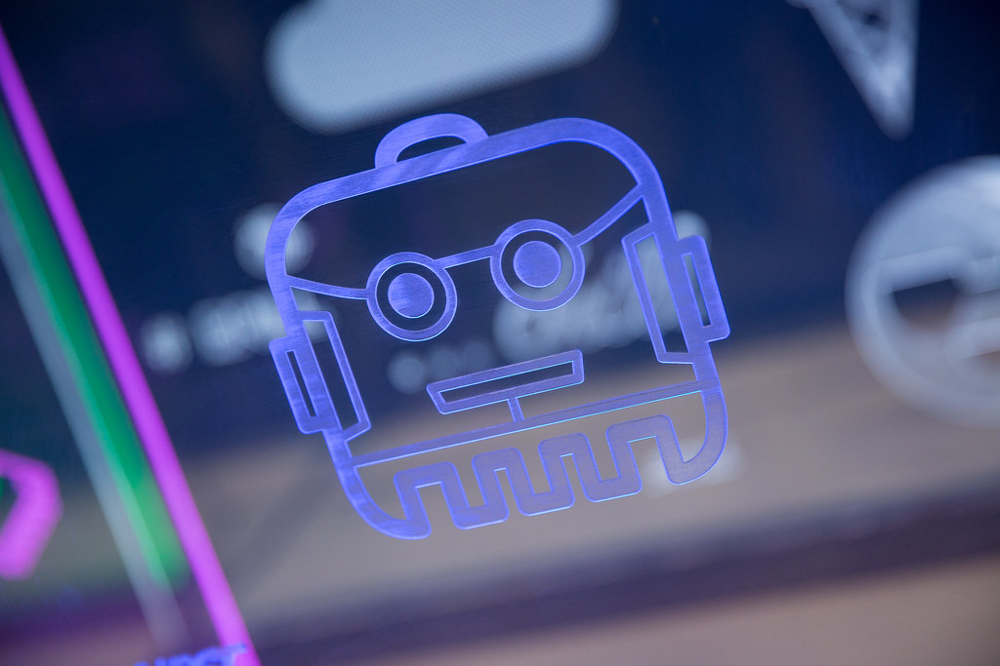

---
title: In the age of A.I - Part 03: It enhances us
author: @kim.tran
authorURL: http://twitter.com/aioznetwork
---

<!--truncate-->
Could AI enhance us to be a better human?

Today, [r](https://www.lanner-america.com/blog/7-ways-ai-will-impact-industrial-automation-in-2020/)obots can easily perform a variety of automated tasks, both inside and outside of the factory. Machine learning, deep learning, and other AI technologies are already being used to reduce human in assembly, packaging, customer service, and HR, among other areas.

The concept of automation aimed at improving labor capacity seems to be macro. Nowadays, AI is getting closer to individuals. It surrounds you, enhancing your capabilities and workflow.

Do you work with Google Doc? Everyday you type on a document, there are words that the AI suggests to you, enhancing your writing speed. You may not notice it but it’s right there with you.

In 2015, a program called Deep Dreaming came out which can combine two different pictures into one. This brings out very complex perceptions where artists can look at them to find out new ideas for their arts.

This is just one of many ways people have been using AI to create new kinds of art.

Art is a field that requires not only all the senses, but also something beyond, the sixth sense, for example. AI is able to provide that for not only artists but also in other fields which require a decision as an outcome.

Finance, sports, medicine are fields where predicting an outcome can make a big pay off. A stock car racing team has been using AI as their advisor. Until now, many key decisions like when to pit for tires or fuel were made by the drivers and the chief using their experience and intuition. Now we have AI that’s making all these calculations and putting out a recommended strategy for them to reference. This system uses all of the data from the race: the braking, steering, throttle, all the acceleration off of every car in the field, GPS, etc. All of this data is recorded real time and fed into an AI program called “Pit Rho”. The tool analyzes the optimum strategies.

When making a decision, humans base on the data they have combined with their experiences, and then sometimes add in a bit of intuition. The strength of an AI system comes in having access to a ton of data and being able to find patterns in that data, generating insights and inferences that maybe people may not be aware of. Therefore, it can predict an outcome which our common senses cannot predict.

However, not everybody chooses to trust an AI to make decisions for their games. You can choose to trust the AI or not because after all, winning or losing in a game doesn’t make anybody die. But what about other situations? For example, life and death situations.

For a long time of history, many firefighters have been completely passive in the fire. Too much smoke and fire, terrible surrounding environment, they fall into a totally a blind search, trying to find people to save until they can't even save themselves. Is there a solution to this predicament?

A group of scientists has been using an AI called C-THRU to enhance human vision.

The concept of C-THRU is a helmet with special glasses clipped inside which allows firefighters to see edges as green lines.

Using powerful edge detection algorithms, the mask detects subtle changes in brightness to predict shapes. The AI program combines all of those processing and turning the dense smoke and near-impossible visibility into a clear-cut scene. Firefighters now can move faster and take less time to save victims. This technology is game-changing when it can save more lives not just victims in a fire but also the firefighters.

AI is not just enhancing humans’ vision but our body. You might still remember about the Dancer Adrianne Haslet-Davis. With her new robot leg, she now can dance again. These robot limbs can go beyond what is lost, enhance us and give us abilities which the original body cannot offer.

Jim Ewing, a climber, had an accident and fell off the cliff from a height of 50 feet. The injuries later healed but the broken leg could not. The bone was mostly dead, leaving him constantly tormented by pain. Jim Ewing decided to have his broken leg amputated and replaced with an artificial leg.

The artificial foot not only brought Jim back to normal life, but also awakened the passion for climbing that had fallen asleep inside of him for years. He is able to go back to climbing again and he even overcomes the Cathedral Ledge, 700 feet of awe-inspiring granite, one of the hell challenging for even the most serious climbers.

AI strengthens our body, helps us to overcome the limits of a normal body. Artificial intelligence technology has been making the seemingly impossible possible. This technology will go even further and you can totally dream of a day when people can have super machine parts on their bodies.

But then, once we implant machines onto our bodies, will we still remain ourselves?

The end of part 03.