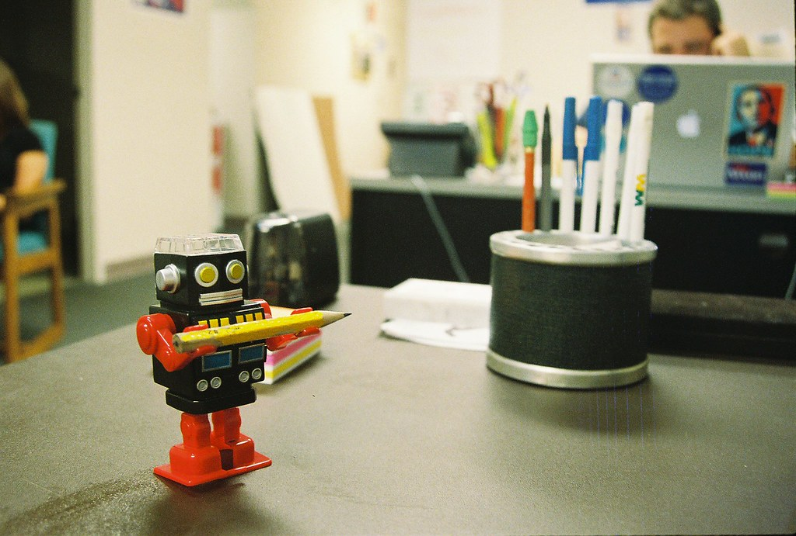

<!--truncate-->
“Will AI take my job?” is one of the most Googled questions. We are now changing and adapting to the new era. Yes, AI will kill jobs, but it will also bring new jobs to the world.

Industry 4.0 has created many breakthroughs in new technologies in areas such as artificial intelligence production, robot manufacturing, internet development, nanotechnology, and biotechnology, etc. Accordingly, the newly born technologies will form new professions, especially those related to interaction between humans and machines.

For example, in Germany, it is estimated that by 2025, Industry 4.0 will create about 350,000 more jobs, an increase of 5% compared to the workforce of 7 million people in 23 manufacturing industries currently participating in the study. The spread of robotics and computer technology will reduce about 610,000 assembly and manufacturing jobs, but will add 960,000 jobs. The IT, analytics and R&D fields require an additional 210,000 highly skilled personnel…all of which are sources of new job opportunities.

Not only that, Industry 4.0 will also create new professions that appear for the first time such as forensic analysts of electronic data and carbon emissions managers, intelligent hardware engineers, operations and maintenance personnel. industrial vision system maintainer, integrated circuit engineer, online sales consultant, online instructor, along with a rather special profession as a calorie nutritionist and self-care assessor.

There will always be a lot of things that only humans can do. The future of work is not human being replaced by machines. It’s humans figuring out how to do their job better with the help of machines.

There are many opinions that the technological revolution will bring less jobs than before. The development of automatic technology will help liberate human labor, increase labor productivity, but also push millions of people to face the risk of losing their jobs. Many traditional industries and trades will also disappear quickly. Example: In 1998, Kodak camera company employed 170,000 people, accounting for 85% of the world photo paper market, but recently this business has ceased to operate.

The craft fields will also disappear, replaced by the emergence of new industries and occupations that require high skilled skills. According to research by the McKinsey Global Institute, it is estimated that by 2030, between 400 and 800 million jobs worldwide will be replaced by automation technology. The birth of smart factories, in which machines play a key role, can operate the entire production process by themselves, gradually replacing previous production lines.

As automation replaces workers with machines, it can exacerbate the disparity between return on investment and return on labor. On the other hand, knowledge will be an important factor of future production and give rise to an increasingly segregated job market into "low-skill/low-wage" and "high-skill/high-wage" segments, thus easily leading to further social stratification. Our economies are based on the premise that people consume. But if fewer and fewer people have decent work, who will be doing all the consuming? Are we producing ever more cheaply only to arrive at a point where too few people can actually buy all our services?

There will still be a certain balance. We come to employment mobility. If the technological revolution is creating fewer jobs, in the future our children will be educated in a new way to perform more complex tasks and we will work less than we used to.

The end of part 06.

**References for the whole series:**

[Japanese man ‘marries’ hologram character Hatsune Miku](https://www.youtube.com/watch?v=dtu4t_Zc3d4)

[Healed through A.I. | The Age of A.I.](https://www.youtube.com/watch?v=V5aZjsWM2wo)

[Will a robot take my job? | The Age of A.I.](https://www.youtube.com/watch?v=f2aocKWrPG8)

[Artificial Intelligence Could Help Solve America's Impending Mental Health Crisis](https://time.com/5727535/artificial-intelligence-psychiatry/)

[The Art of Code - Dylan Beattie](https://www.youtube.com/watch?v=6avJHaC3C2U)

[Cách mạng công nghiệp 4.0 tạo ra nhiều ngành nghề mới](https://namdinh.gov.vn/portal/Pages/2021-5-12/Cach-mang-cong-nghiep-4-0-tao-ra-nhieu-nganh-nghe-x165sz.aspx)

[A.I. Is Making it Easier to Kill (You). Here’s How. | NYT](https://www.youtube.com/watch?v=GFD_Cgr2zho)

[In the Age of AI (full film) | FRONTLINE](https://www.youtube.com/watch?v=5dZ_lvDgevk)

[Researchgate.net](https://www.researchgate.net/figure/A-husky-on-the-left-is-confused-with-a-wolf-because-the-pixels-on-the-right_fig1_329277474)

[Solutions to address AI’s anticipated negative impacts](https://www.pewresearch.org/internet/2018/12/10/solutions-to-address-ais-anticipated-negative-impacts/)

[Preparing for a future with Artificial Intelligence | Robin Winsor | TEDxYYC](https://www.youtube.com/watch?v=f7dhOHMX0js)

[The Rise of the Machines – Why Automation is Different this Time](https://www.youtube.com/watch?v=WSKi8HfcxEk)

[The Real Reason to be Afraid of Artificial Intelligence | Peter Haas | TEDxDirigo](https://www.youtube.com/watch?v=TRzBk_KuIaM)

[Artificial Intelligence: it will kill us | Jay Tuck | TEDxHamburgSalon](https://www.youtube.com/watch?v=BrNs0M77Pd4)

[What happens when our computers get smarter than we are? | Nick Bostrom](https://www.youtube.com/watch?v=MnT1xgZgkpk)
