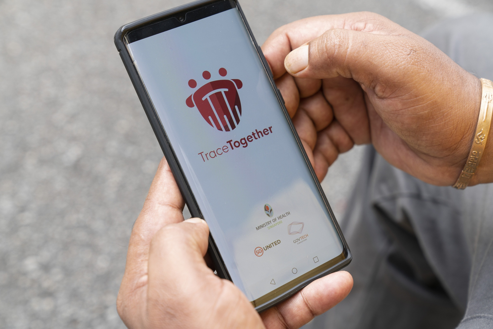
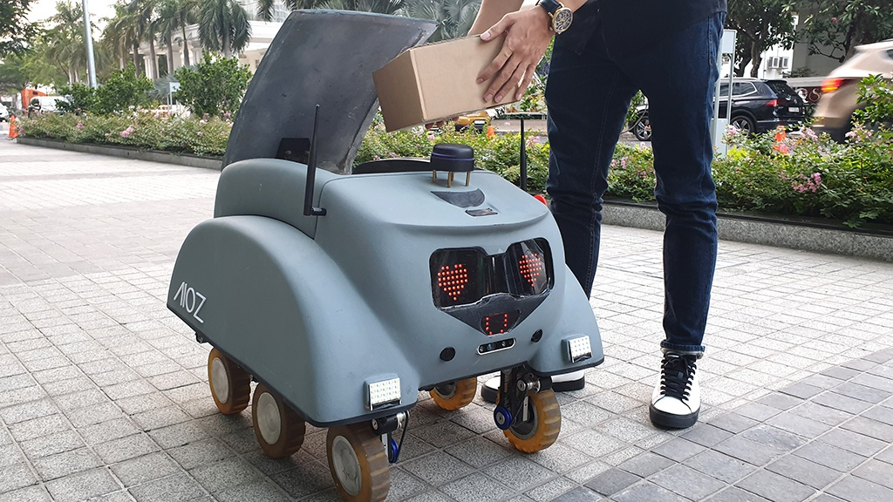
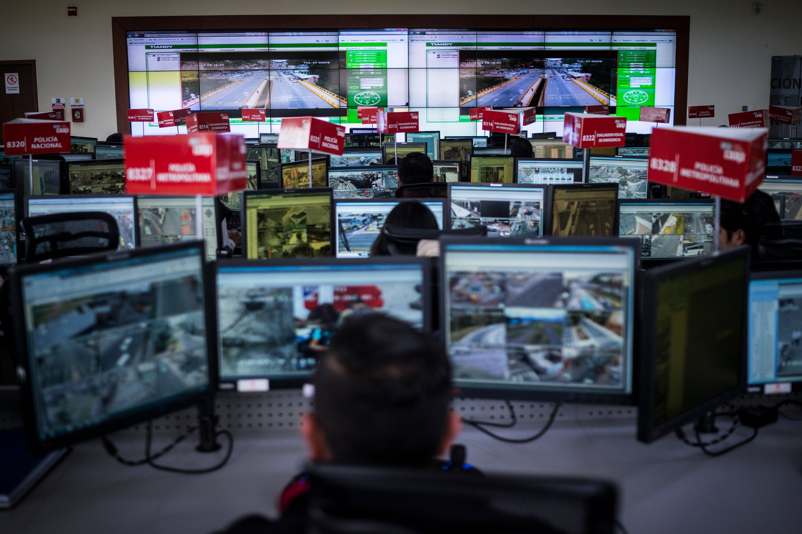

<!--truncate-->

Source: [https://www.healthcareitnews.com/](https://www.healthcareitnews.com/)

Nearly two years have passed since the first case was confirmed in Wuhan, China. Covid-19 now is still a global epidemic. As yet, around 187 million people have been infected worldwide and more than 4 million have died.

How to minimize the number of infections and deaths? What should we do to prevent cross-contamination in the isolation area? How to manage people in the period of social distancing? To solve this problem, many technology engineers have successfully researched and developed technology applications. Let's find out which technology was created to defect Covid-19.

### Health sensors and tracing application

While the outbreak of Covid-19 is too strong, with a rapid spread in the community, the use of technology applications to trace and localize the source of infection will help reduce community infections. Launched on March 20, Singapore's TraceTogether app has effectively detected and prevented the spread of Covid-19 in Singapore. As soon as a new case is confirmed, usually, the patient will not remember the schedule and the people he or she has been in contact with, making the epidemiological investigation difficult and time-consuming. By using wireless Bluetooth technology, TraceTogether has been able to identify people in close contact with an infected person, helping to speed up tracing and localization.

Source: [https://www.bloomberg.com/](https://www.bloomberg.com/)

When the epidemic began in China, many cities were on lockdown, and citizens were forced to stay at home, more than 1.1 million times used the Ping An Smart Health application which provides online sessions for users. We were possible to monitor and detect the people with symptoms of Covid-19 through it.

### Robotics

Robots are equipped in hospitals to disinfect, automatically measure temperature, deliver food to infected people, reduce cross-infection and reduce the risk of infection. The robot is built to automatically follow the route and avoid obstacles thanks to the radar system.

In the complicated situation of the Covid-19 epidemic, the AIOZ team researched and developed the project named "BettleBot"

- BettleBot: Providing remote communication that supports security staff observe citizens during social distancing such as not wearing a mask when going out.
- BettleBot: supporting doctors and nurses in hospitals and quarantine areas such as transporting medicine and food; spray disinfectant, etc. In addition, there is a remote medical examination function that allows patients can communicate with doctors. This can help to reduce the risk of infection.

    

    BettleBot help to manage in isolation area which achieved the first prize in the " Hack Co Vy" competition

### Artificial Intelligence, Big Data, and facial recognition

When the Covid-19 spreads on a large scale, it is very difficult to control. However, China relies on China's surveillance network, which uses artificial intelligence technology with a network of hundreds of millions of cameras and facial recognition software. This system can monitor the travel history of people, thereby checking their possibility of infection. Moreover, it also helps the government to monitor people to ensure obey self-quarantine orders. A system for facial recognition even while wearing a mask and infrared temperature measurement have been installed in major Chinese cities thank to using big data of China's surveillance network.

Source: h[ttps://www.nytimes.com/](https://www.nytimes.com/)

Besides, Tampa Hospital in the US has applied facial scanning software, using AI technology to identify patients with fever in the hospital, to reduce the risk of infection in the hospital environment.

The pandemic is still very complicated and prolonged in many countries around the world. Information technology solutions are considered to be one of the effective tools in the prevention of the Covid-19 epidemic. Many countries around the world have shown the power of technology to help control the spread of the disease, gradually return to normal life, and develop the country's economy.
