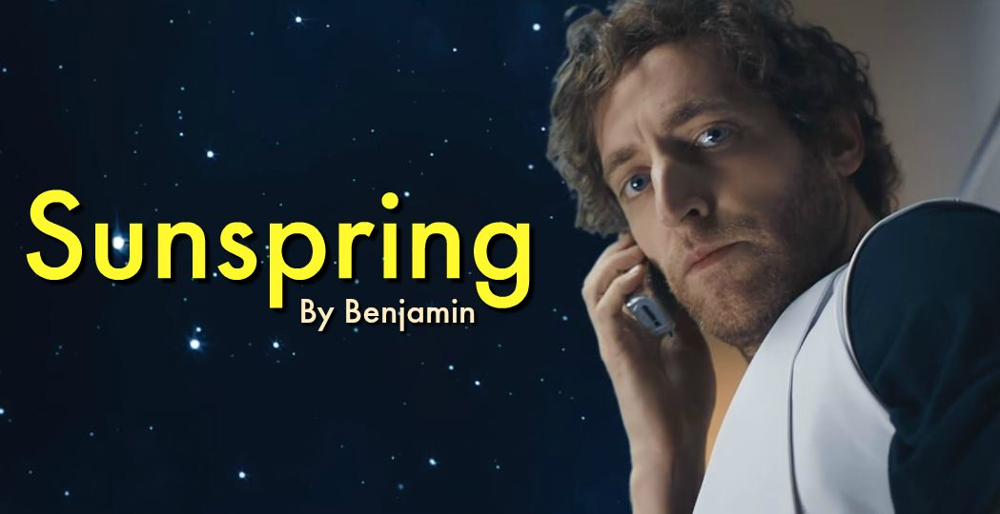
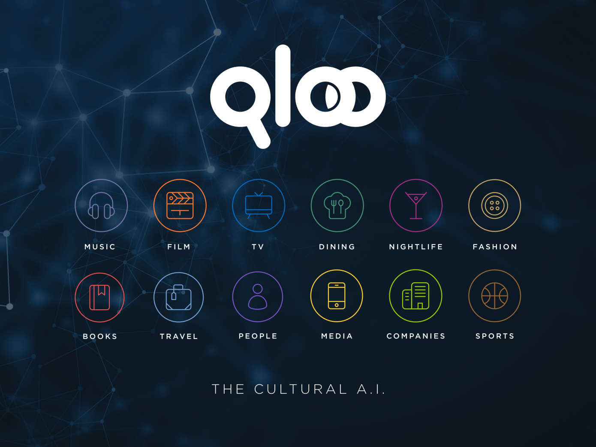

<!--truncate-->

Source: [https://e.huawei.com/](https://e.huawei.com/)

The filmmaking industry has changed for the past 25 years. Thanks to technology we have more and more tools to create an extraordinary movie. There is no doubt that the rising of digital technology, diverse features of edit programs, 3D technology, drones, and Gimbels gave film producers a great advantage. Now, we have AI which created a breakthrough in thinking about making and enjoying movies.

### AI is changing the filmmaking industry

You must have heard a lot about the "Technology revolution 4.0" that artificial intelligence is a core factor. Nowadays, filmmakers are using AI to improve production, come up with an effective marketing strategy and develop audience preferences. AI has already infiltrated filmmaking and it's changing this industry.

Do you remember Thanos who wants to wipe out a haft of life in the universe in Avenger? To create such a digital character, the Marvel Studio resorted to AI. Digital Domain, the firm that joins to work visual effects on the film used a machine learning system called Masquerade to make the motion of the character performance more natural. The actor had to wear a helmet camera which tracked his facial movements by 100 to 150 dots, this net dot was in fairly low-quality rendering. Then, the Domain team fed the data from the camera into a machine-learning algorithm to find suitable shapes with high resolution.

AI also can be utilized to help you write scripts for movies. I'm very impressed when I hear about Benjamin, a filmmaking AI which researched and developed by NYU. If you fed it a tone of science-fiction scripts. It can create for you a new script that learning from the data. AI algorithms analyze, understand and sort the input data to come up with a new story. Benjamin scripted a short sci-fi film about three people known as "Sunspring". Although now it's still unconventional, we believe that in the next few years when this technology becomes really smart, it will be a boom for the filmmaking industry. 

Source: [https://twitter.com/](https://twitter.com/) 

An element that characterizes AI is optimizing your task. AI can offer movie producers a simplified process to produce a movie. It can help to automatic of analyzing script process, planning efficiency schedule, budgeting, etc. It saves filmmakers a lot of time. 

No matter what major you work for, the promotion of the product is always a challenging task. For the film industry, the first thing you need if you want to do marketing for the movie is an impressive trailer. Do you believe that AI can assist to build a movie trailer? It's totally yes. In 2016, IBM produced the first movie trailer - Morgan by applying AI technology. And do you know how was it created? IBM used Waston, a tool that helps to arrange visual and audio analysis to determine the most salient scenes for a trailer from the movie Morgan that the producer can edit and arrange together. Waston analyzed thousand of thriller sci-fi movie trailers and learned from the reactions of audiences to generate a trailer automatically. 

Not only movie trailer, the success of promotion a movie need more factors. AI algorithm is training to ensure that movie will be a hit. AI is used to predict and develop audience preferences. Movie studios can base on this to plan for their marketing strategy. Qloo, an AI platform that helps you to identify viewer performances and predict consumer taste. It changes the way we market movies to maximize film revenues. 

Source: [https://techcrunch.com/](https://techcrunch.com/)

As you can see that there is a lot of AI technology in filmmaking. Movie producers are leveraging the power of AI to boost a new cinematic era. The interests of AI is fascinating which gradually change the media and entertainment world. We believe that shortly AI will be smarter and smarter to work as human assistants to raise the standard of filmmaking.
