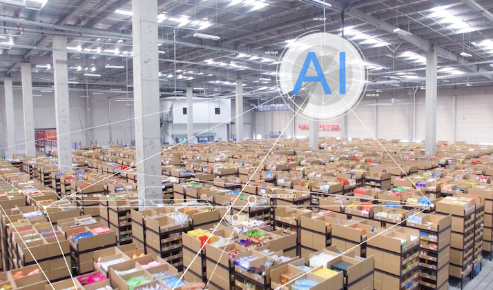
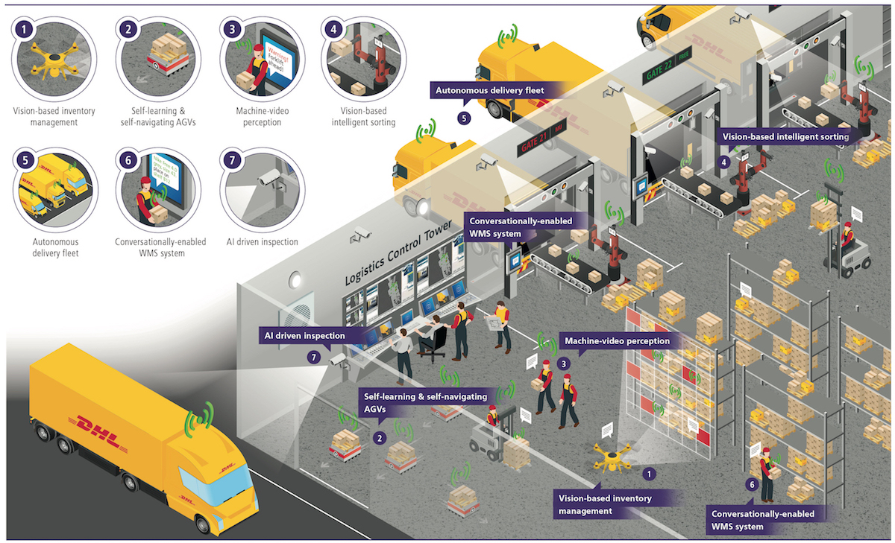
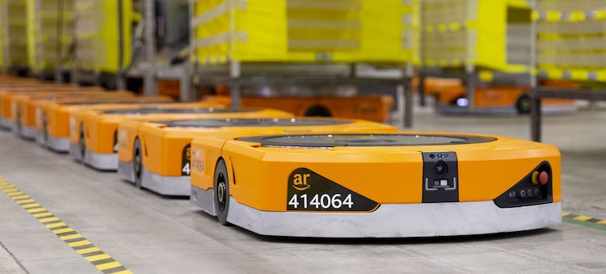

<!--truncate-->

[https://www.alizila.com/](https://www.alizila.com/)

Managing goods, managing warehouses,  and efficiently transporting goods is a great challenge for shipping companies. Any solution to struggle with this? Artificial Intelligence!. There are a lot of AI solutions and applications in the Logistics and Supply Chain industry. Logistics companies leverage Machine Learning and AI to automate and optimize their operation. And smart warehouse is one of their best choices.

### Smart Warehouse System

There is no doubt that automating makes everything faster, more convenient, and more cost-effective. A smart warehouse where your operation is done through automated software that was built by applying AI technology. From receiving the order to delivering it to the shipper. Now, with the Smart Warehouse System, every task is automatic instead of your staff has to work around your warehouse with a list, checking for stock, and confirm the order to the customer. This system is not only an automatic process that confirms an order but also receives goods, sorted and organized automatically. 

On the other hand, Computer Vision, an AI technology that can help to scan and detect damage. Logistics companies can determine damage depth and take action for this to avoid customer complaints. DHL - the giant in the Logistics field is using Intelligent Computer Vision for surveillance and analyzing the operation to innovate how shipments are packed as well as how they are inspected.

[https://www.ibm.com/](https://www.ibm.com/)

By utilizing AI in your warehouse operation will help the firm: 

- Pulling orders from supplier to customer in the fastest time.
- Minimizing manual errors.
- Improve customer experience.

### Warehouse Robots

Flask back in the past, Logistics and Supply Chain is a labor-intensive industry that requires a large number of staff to process in the manual warehouse. With the development of technology, warehouse robot is one of the factors to enhance Supply Chain Operation. These kinds of robots were created to assist humans in picking, sorting, transporting to the employees, then they will pack the goods and post them. The robot can move automatically in the warehouse and can lift about 500 kilograms in weight and rotate 360°. They are also capable to charge themselves automatically.

Today, there are many kinds of warehouse robots is using in logistics company's warehouse. Thanks to these robots, the labor cost can be reduced by about 70%. They move faster than people can and carry more parcels, also minor human errors. 

[https://roboticsandautomationnews.com/](https://roboticsandautomationnews.com/)

Amazon was considered the world's biggest retailer which is famous for lightning-fast delivery possible. In Amazon's warehouse where more than 200 thousand robots are working day by day. Leverage in AI technology, they brought customers what they want quickly. 

AI solutions have completely changed the Logistics and Supply Chain industry. Especially, warehouse management and arrangement. Smart warehouse optimizes your workflow.

Adopt it and don't be left behind!
