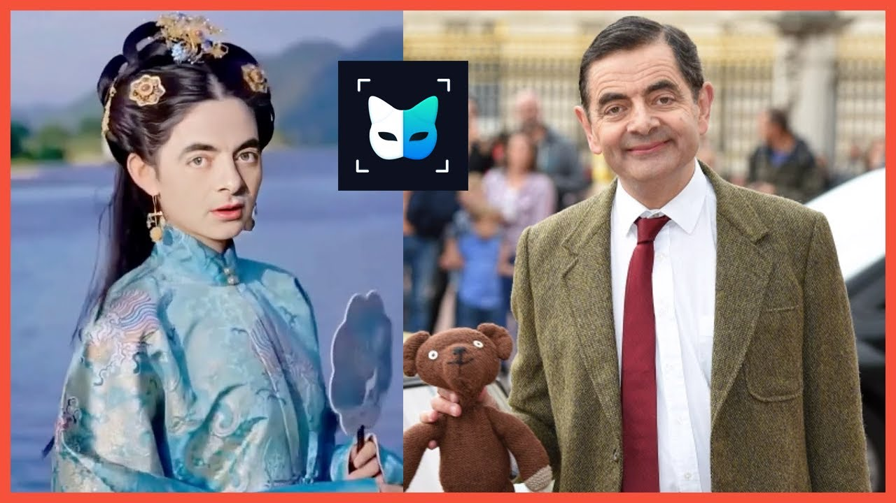

<!--truncate-->

[https://krazytech.com/](https://krazytech.com/)

Have you ever wonder what happened if AI becomes super-smart? Will it dominate humans?. As you may know, AI was created to help us deal with complex problems and automated tasks. Do you realize that we are more and more dependent on it in our daily life? Many of us feel very excited and amazed by what AI can do.

But some people are feeling scared of the power of AI? Why? Do you think we should be afraid of it?

Let's find out!

### AI will replace us in many fields?

Nowadays, by using AI systems, operations can be simplified in an automatic mode. However, it brings laborers to a considerable challenge. If everything is automated, what will humans do for a living? Not only manual jobs but also professionals in many fields also face a high risk of losing their jobs

We cannot deny that automated machines, using AI technology, are many times more capable at work than humans. They don't need to rest like humans; with the ability to work 24/24, AI replaced humans in repetitive tasks to boost efficiency.

AI can be a Customer service executive, a Receptionists, or maybe a market research analyst, even a doctor. AI is implemented in many fields. Furthermore, people say that AI is known only for optimization, and it can't replace creative humans. But AI can be clever to draw pictures, write content.

[https://www.timeshighereducation.com/](https://www.timeshighereducation.com/)

AI's achievements recently make many people are worried about its outstanding ability. For instance, China launched its first virtual student- Hua Zhibing, who is proficient in painting, Calligraphy, and composing music. She is learning computer science at Qing Hua University, and she has a learning speed much faster than ordinary people.

This worries many people.

### Will AI take over the world and harm us?

When we were a child, there were many movies about AI with pretty scary stories. The killer robot, machine dominates humans, etc., like Terminator or Matrix. Scary, right? It makes us afraid that a machine got too smart and we lost control of it. I wonder what if AI could learn millions of times faster than we can? The pioneering tycoon in the field of AI - Elon Musk, also said: "Mark my words — A.I. is far more dangerous than nukes"

Is AI really that scary?

Have you ever heard of Deep fake technology? This tech is a bit scary, and it can capture a person's face and use it to replace someone else's face in a video. Imagine one day your face appearing in the videos with harmful content going viral on the Internet while you know nothing; this could turn your life upside down. Deep fake has caused concern to many governments because it can be an effective tool for those with bad intentions.

[https://www.youtube.com/](https://www.youtube.com/)

However, if you know how to apply them to valuable work for society, you will find this technology quite impressive. A company has created a Deep fake video featuring football legend David Beckham to promote malaria prevention in nine languages. Currently, Deep fake is widely used in the entertainment field. FacePlay, an application that allows users to input their faces into the available videos that are trending recently, has shown quite interesting when using it.

So... AI is a threat? The answer is No.

AI learns from what data we fed into them, so AI can harm us when it is in the hands of those who intend to harm humans. If we know how to use AI rationally, AI is an effective support tool for you. Even though AI is still at the beginning, AI is now beneficial in many fields. I believe that we, together with AI can shape modern life. Let AI be your friend, not your enemy.
