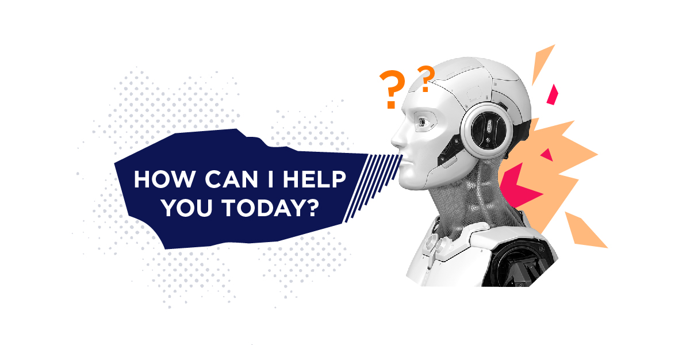
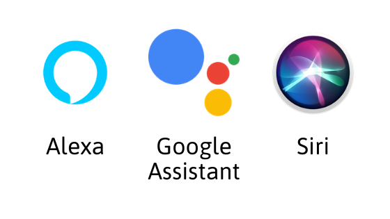

[https://www.iteratorshq.com/](https://www.iteratorshq.com/)

When the world is transforming into a digital world, virtual assistants will not be a strange word to everybody. And you? Do you know the tool called Virtual Assistant? Let's find it out together!

### What is a Virtual Assistant?

According to Wikipedia, a Virtual Assistant is " An intelligent virtual assistant (IVA) or intelligent personal assistant (IPA) is a software agent that can perform tasks or services for an individual based on commands or questions". Also known as the AI assistant which was created based on the core of AI including Machine Learning, Natural Language Processing, and Speech Recognition. Along with the development of smartphones, virtual assistants are also becoming more and more complete and "smarter".

Some popular virtual assistants today can be mentioned as Apple Siri, Google Assistant, Amazon Alexa, Microsoft Cortana, etc. In addition, technology engineers also program AI assistants to target certain for individual purposes.

### The outstanding features of AI Assistant

So what can AI Assistant do?
In case you are too busy with your job, with your daily life and you need an assistant to help you handle basic tasks like reply email, schedule appointments, organize meetings, etc. then AI Assistant is a suitable choice. The feature of a virtual assistant is that you just need to give a voice command and it will support you to do it. The virtual assistant has the ability to recognize and analyze speech so that users can easily use it through voice.

Virtual assistants also have the capacity to learn from users, remembering tasks and things that you often ask for, because the core of its is AI, it can collect user data and learn to more understand the user. Just equipped with a small device, you have an effective assistant right away.

[https://www.alexeko.com/](https://www.alexeko.com/)

iPhone users are probably no stranger to Siri. Maybe you will feel interested in what you can do with Siri. Staying connect with her without any touch to your phone, you just need to ask what you want. Siri can help you to do all kinds of useful things. From helping you set the alarm, take notes, create reminders to something a great deal more like searching and booking tickets, making reservations. What's more? Siri is also capable of learning from user habits, for example, remembering what you search for to recommend the most relevant results.

Beyond Siri, Google Assistant is also an equally competitive virtual assistant with outstanding features. Do you think a digital tool can't converse with you? Not really, sometimes you will have to laugh out loud when communicating with your virtual assistant.

With the different features, Alexa is the solution for your home life. Besides the same features as Siri or Google Assistant, Alexa is a virtual assistant for your home, you can use Alexa as a control center for smart devices in your home. She can turn off the light, open the door, close the curtains, say hello when you back home, and much much more. When you connect Alexa-compatible devices, you just have to talk to her without being up close. Alexa is also a great protector for your home. By analyzing audio and camera, Alexa will notify you through the app if it detects anything unusual around your home while you are away.

### What's more incredible?

If you're a fan of Marvel, you must know Jarvis, a super assistant of Iron Man - our hero. While watching the movie I was impressed with what Tony was able to do with Jarvis with his multiple functions. It was implemented AI techniques like natural language processing, speech recognition, face recognition, and reinforcement learning.

[https://archinect.com/](https://archinect.com/)

Have you ever wondered whether we can build our own Jarvis? The answer is yes! Tech wizard - Mark Zuckerberg built his own Jarvis AI. He started to create a simple AI to help him in his home by talking with his AI butler via an APP he coded by himself which uses AI to understand him. With a sort of video of fewer than three minutes, we can see some of the tasks that Mark's Jarvis can do like: wake him up every morning, play with his children, etc. One of the best things about Jarvis is his friends' facial recognition at the door. Although it is still not as perfect as the Jarvis in the Iron Man version, with the current development of science and technology, we should believe that will come true in the near future. It's just the beginning!

If you've used AI Assistant before, I'm sure you'll be amazed at what it can do. AI continues to innovate and the world is transforming. So what you waiting for, let's own an AI Assistant.
