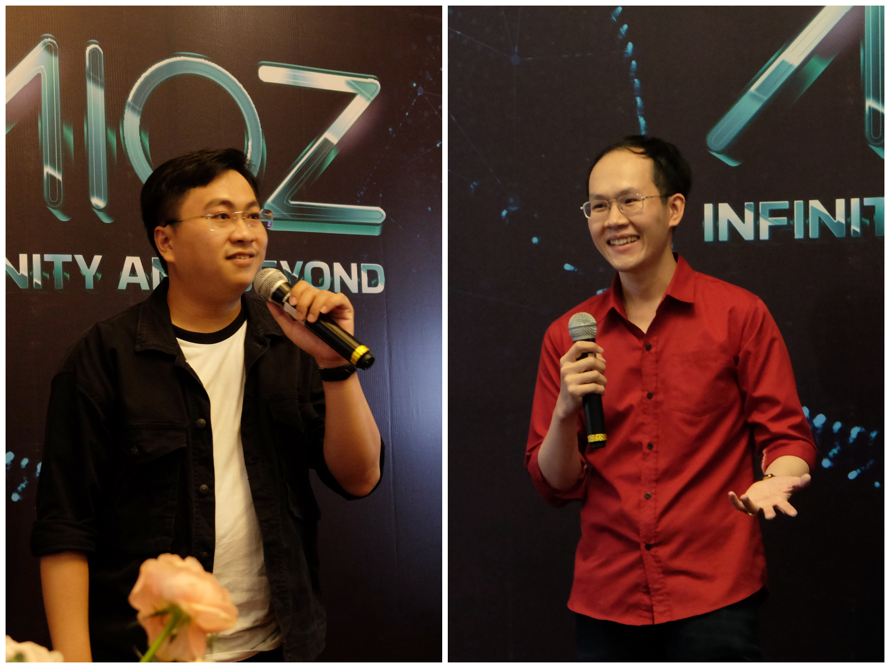

<!--truncate-->

Work fills a large of our time, but besides working, we all need to recharge once in a while. So… Let's have a party!
Covid, work from home, limited interaction between members, budget shortfall, salary reduction, staff cuts, etc. After 2 years full of difficulties, AIOZers, together, we got through it. We worked hard and now we stand here to express, share and burn ourselves out. 

The leaders also took this opportunity to send thanks to all the members of AIOZ for always accompanying the company. We work together and have these memorable memories together. Each member of AIOZ has their own color and personality, and together we have made great efforts to get over them.

Experiencing difficulties, the more we defeat them, the more I feel that humans have a great power - said by Mr. Hien Head of Blockchain.

Stay close together, and talk with others more. After all, we can still sit together for an evening after work to refresh. We socialized, we sang and we enjoyed ourselves together. At the elegant, yet cozy atmosphere party, AIOZers shared their thoughts about life, work as well as their colleagues. 

Mr. Minh Nhat - a new member of the company shared: "At first impressed when joined AIOZ, I felt that everyone was very nice, I really liked the working environment at the company. Although I am a fresh graduate, I have had the opportunity to try a fairly large project at the company, but thanks to the support of my team, I now have some certain results."

With the company through many ups and downs, I have experienced a lot of things, seen everyone's efforts to step up step by step, I really appreciate those things. I hope everyone can stick together more so that our company can more and more develop. A sincere sharing from Mr. Binh, a member who has been joined the company since its early days.

.jpg)

There have been difficulties but we still stay together and we will still accompany each other to conquer challenges and build a stronger AIOZ.

Looking forward to our new breakthroughs…

We believe it will be an unforgettable night for all of us.

Cheers!
