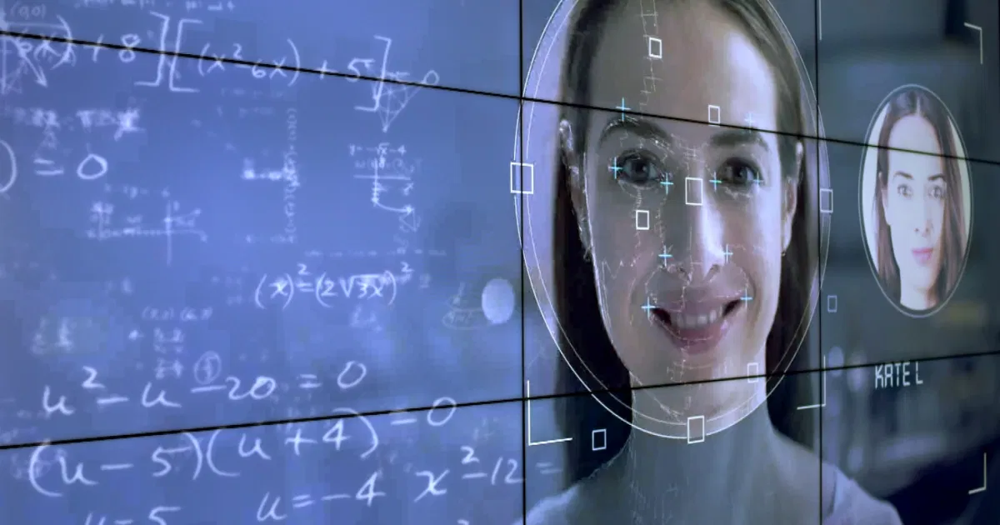
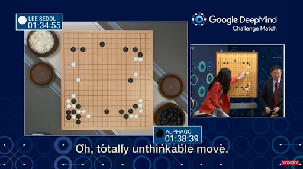
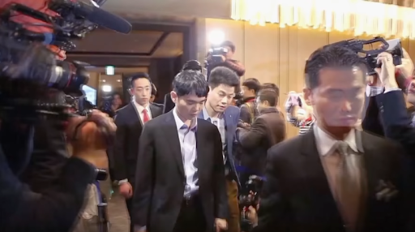
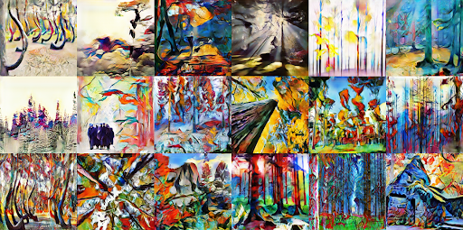
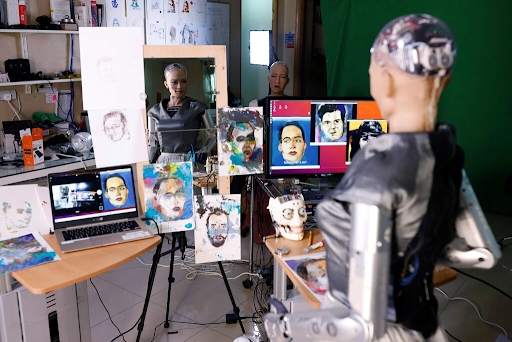
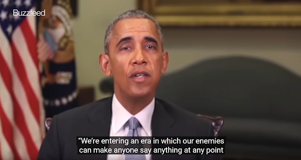
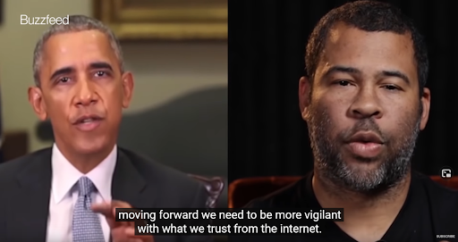
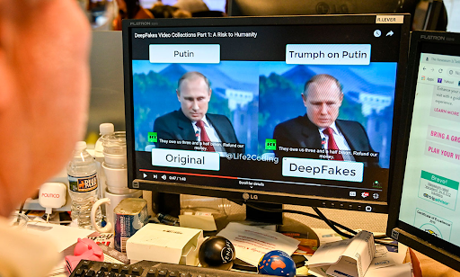
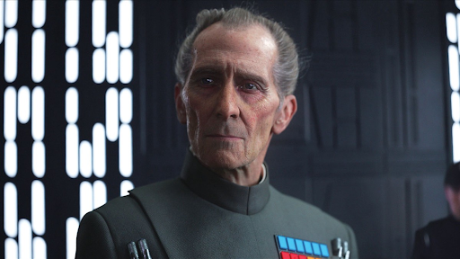
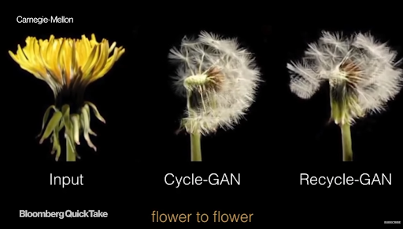

<!--truncate-->

AI is changing our world. But what can it really do?

What will become true and what will remain science-fiction?

It was 2016 in South Korea, a breakthrough moment when the champion of Asian board game Go, Lee Sedol, took on an AI program developed by Google, AlphaGo. To people in Asian, especially Korean, this is not just a game but a fight with national pride. They were sure that Lee Sedol would beat AlphaGo hands down. The game was watched by millions of people. Can machines overtake human intelligence?

“I’m confident about the match. I believe that human intuition is still too advanced for A.I to have caught up.” - said Lee Sedol.

But in the face of Sedol’s intelligence and rich experiences, the machine is fed by all kinds of Go games, and it “studies” them, it learns their moves and figures out its own moves. It comes up with creative moves that humans hadn’t thought of before.

In the end, scientists watched AlphaGo win four out of five matches of the game. It was an incredible victory for A.I and Deep Learning.

“AlphaGo is just a toy game, but it succeeded and it woke everyone up. I think it is going to be remembered as the pivotal moment where A.I became mature and everybody jumped on the bandwagon.” - said Kai-Fu Lee, author of “A.I Superpower”

Besides Go games, A.I can now do painting.

Do you know Picasso with his collection of abstract paintings? Now A.I can do the same.

Artificial intelligence has been developed to create paintings in unconventional styles – and much of its output has already been given the thumbs up by the artists.

Another example below is an art that was created by A.I by merging a real photo with a sample of artstyle.

The technique used to do this is something called Deep dreaming came out of a project in Google in 2015. This is just one example that people are using modern technology to create a new kind of art.

A.I can create unique arts. Their arts can be denominated in the form of NFT (non-fungible token) - a digital asset using blockchain technology, making it impossible to destroy or copy. One of those NFT is Sophia’s artworks.

Sophia is the most famous robot of Hanson Robotics, with the ability to imitate facial expressions and talk like a real person. This robot is also capable of recognizing people. In 2017, Sophia attracted attention when she was granted Saudi citizenship, becoming the world's first robot citizen.

On March 23, 2021, Sophia auctioned her own painting. The work called "Sophia Instantiation" is a 12-second long MP4 file that shows the process of turning Bonaceto's portrait into a digital one of Sophia, which is sold along with a real self-portrait by Sophia.

Sophia sold her artworks for nearly $700,000 in the frenzied market for digital art. This vent might open the way for the emergence of A.I in the art world.

Now let’s look at this picture.

Do you agree with what Obama said? Whether you agree or disagree, you need to know one thing: Obama did not say that.

It was a fake video of President Obama created by Jordan Peele to demonstrate how easy it was to put words in someone else’s mouth.

This technology is called Deepfakes. It is a technology that can stitch anyone in the world into a video or photo they never actually participated in. The term "deepfake" comes from the underlying technology "deep learning," which is a form of A.I.

There are several methods for creating deepfakes, but the most common technique is face-swapping technique using a neural network. You first need a target video to use as the base for the algorithm and then as many as video clips of the person you want to insert in the target. The more videos you feed the A.I, the more realistic the result is.

Not only swapping faces of the living, this incredible power has actually become a bridge between the living and the dead.

Peter Cushing, a Star War actor who died in 1994, was back in the new episode of the series: [Rogue One: A Star Wars Story](https://lwlies.com/reviews/rogue-one-a-star-wars-story/). Reviving a long-departed star for the purposes of a commercial property bought several sparking controversy, but whatever it caused, delighted fans or troubles for the movie, we have to admit it was an amazing technical result.

In this A.I era, what was impossible before is now within our reach. Living actors playing dead characters is common, now dead actors can play living characters. Even further, family members who never got to see their ancestors, can now go back in time and see them move and smile like they’re still here.

The A.I technology behind it is rapidly improving. In the future, it will become even more accurate. Researchers at Carnegie-Mellon revealed unsupervised software that accurately renders not just facial features but changing weather patterns and flowers in bloom as well.

Evenmore, there is CereProc, an application which creates digital voices for people who lose theirs from disease.

A.I has proven that it is a powerful existence. It can handle a vast amount of data beyond anything any human can handle. There are just typical examples to help you gain a basic view of how smart A.I can be. They are indeed smart, and they will become smarter as it spreads more and more over the world. You don’t know how A.I can shape the future but you ought to be ready for it.

The end of part 01.